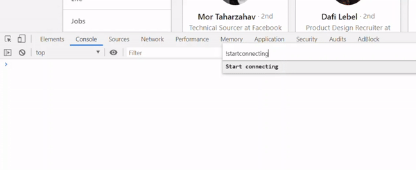

# LinkedIn Connect

LinkedIn Connect is a configurable and easy to use JavaScript script to automate connections with personalized messages.

## Prerequisites

Make sure your LinkedIn is in English

## Usage
1. Go to https://www.linkedin.com/company/{COMPANY_NAME}/people/
2. Modify the constants at the top of [linkedin_connect.js](https://raw.githubusercontent.com/mariiio/linkedin_connect/master/linkedin_connect.js) to your liking

| Constant| Description |
| --- | --- |
| `WAIT_TO_CONNECT` | Time in ms to wait before requesting to connect |
| `WAIT_AFTER_SCROLL` | Time in ms to wait before new employees load after scroll |
| `MAX_SCROLLS` | Max depth of pages to scroll down to |
| `MESSAGE` | Message to connect (`%EMPLOYEE%` and `%COMPANY%*` will be replaced with real values) |
| `POSITION_KEYWORDS` | Keywords to filter employees in specific positions |

3. Run it in the chrome dev tools [console](https://developers.google.com/web/tools/chrome-devtools/open#console) (or add it as a [snippet](https://developers.google.com/web/tools/chrome-devtools/javascript/snippets#runsources))

## Contributing
Pull requests are welcome. For major changes, please open an issue first to discuss what you would like to change.

## License
[MIT](https://choosealicense.com/licenses/mit/)

## Disclaimer
The code within this repository comes with no guarantee, the use of this code is your responsibility.
Use at your own risk.
